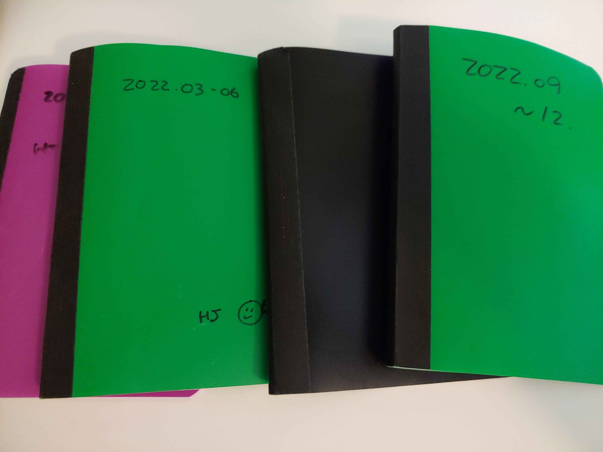

# Book 
I read : 
- Tyranny of Merit
- Range
- Titan's Tools
- Atomic Habit, 
- Original, 
- Think again, 
- Mastery, 
- Guns, Germs and Steels, 
- 공부하는 힘
- Deep Work 
- [Digital Minimalism_Cal Newport](https://github.com/dolihj/Misc/blob/main/BookReview) 
- [How will you measure your life_Clayton Christensen](https://github.com/dolihj/Misc/blob/main/BookReview)
Book of the year : Think again

# Newly learn at Work 
- System engineering(Cameo)
- Session Vector Routing 
- Docker
- Core Emulator 

# I tried  
- Started new job in APL
- Kendo  (Apr. ~ with Hann )
- Cycling  (2021~)
- Writing with Obsidian  (~)
- Book club (2021)
- English Training with Julie(Sep ~)
- Joining 2nd brain - Writing forum

# Appreciation in 2022

- Healthy Family - 1st mammogram 
- Kendo with Hann- It is really fantastic experience - hitting your mom/son with a bamboo sword :-) 
- New Job - I can finally sleep without phone alarm and learned new things having sufficient time to study!
- Met wonderful people thru several meetings and new job

