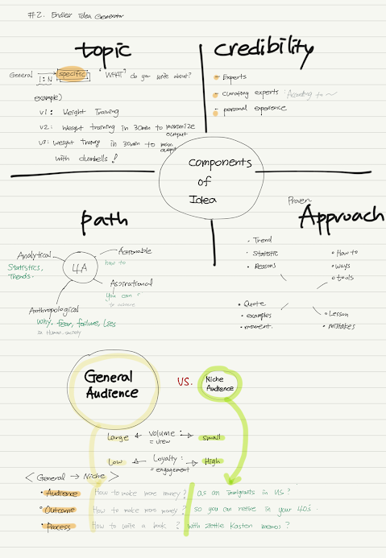
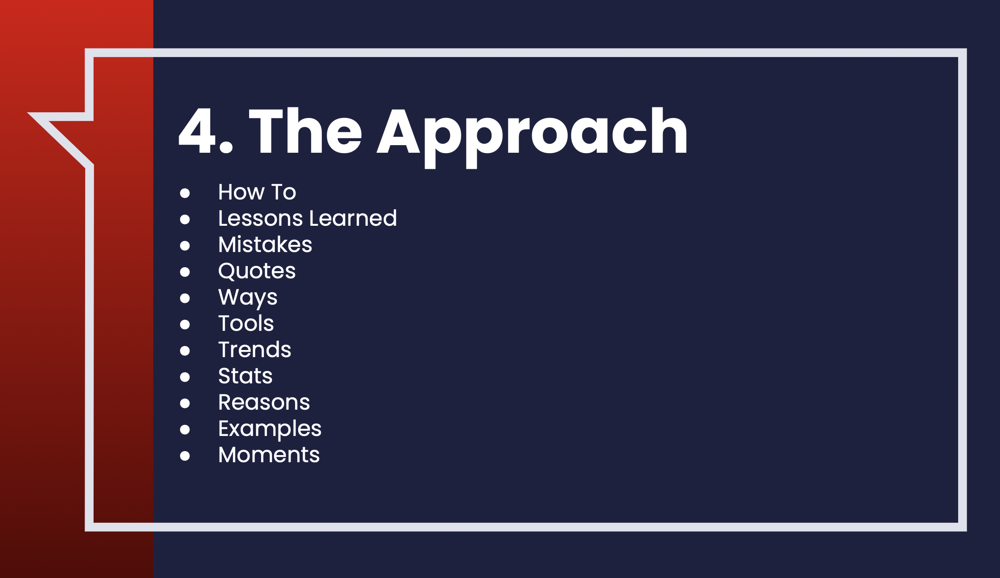

## **Topic + Credibility + 4A Paths + Proven Approach  

-   [Actionable + How To + I'm The Expert] **I Just Quit My 9-5 And Doubled My Monthly Earnings. Here Are 5 Steps You Can Take To Do The Same‍**
-   [Analytical + How To + Curated Experts] **A New Study Shows Millennials Are The Poorest Generation. Here's The Advice The 10 Biggest Financial Planners Gave About Saving For Retirement‍**
-   [Aspirational + How To + Personal Story] **I Used To Have $150,000 Of Debt. Here's My Step-By-Step Guide For Achieving Financial Freedom—And How You Can Do It Too‍**
-   [Anthropological + How To + Curated Experts] **Mark Cuban Just Said Something In An Interview With CNBC That Reveals The Real Reason So Many People Never Achieve Financial Freedom**

# Analytical 
## Trends : (+ personal experience)
Low-code could replace "traditional" coding within months
(https://www.techradar.com/news/low-code-could-replace-traditional-coding-within-months)

## Reasons : 
3 Reasons It's The Best Time In 10 Years To Buy Google (NASDAQ:GOOG)
[https://seekingalpha.com/article/4543540-3-reasons-best-time-10-ye](./img/https://seekingalpha.com/article/4543540-3-reasons-best-time-10-years-buy-google)

# Actionable
## How  to +  Expert
How to Win With Money in 7 Baby Steps | RamseySolutions.com
(https://www.ramseysolutions.com/budgeting/how-to-win-with-money-in-7-easy-baby-steps)

# Anthropological 
## Reasons + Curated experts 
Many young people shouldn’t save for retirement, says research based on a Nobel Prize-winning theory
[https://www.marketwatch.com/story/many-young-people-shouldnt-save-for-retirement-says-research-based-on-a-nobel-prize-winning-theory-11664562570](./img/https://www.marketwatch.com/story/many-young-people-shouldnt-save-for-retirement-says-research-based-on-a-nobel-prize-winning-theory-11664562570)

# Aspirational

## Lessons + Curating experts 
Life lessons from Mahatma Gandhi that parents can teach their children
](./img/https://www.hindustantimes.com/lifestyle/festivals/gandhi-jayanti-2022-life-lessons-from-mahatma-gandhi-that-parents-can-teach-their-children-101664599889170.html)

## you can  + quoting personal experiences 
7 Inspiring Stories on How Exercise Can Change a Life Forever
(https://dailyburn.com/life/fitness/inspiring-stories-fitness-motivation/)

