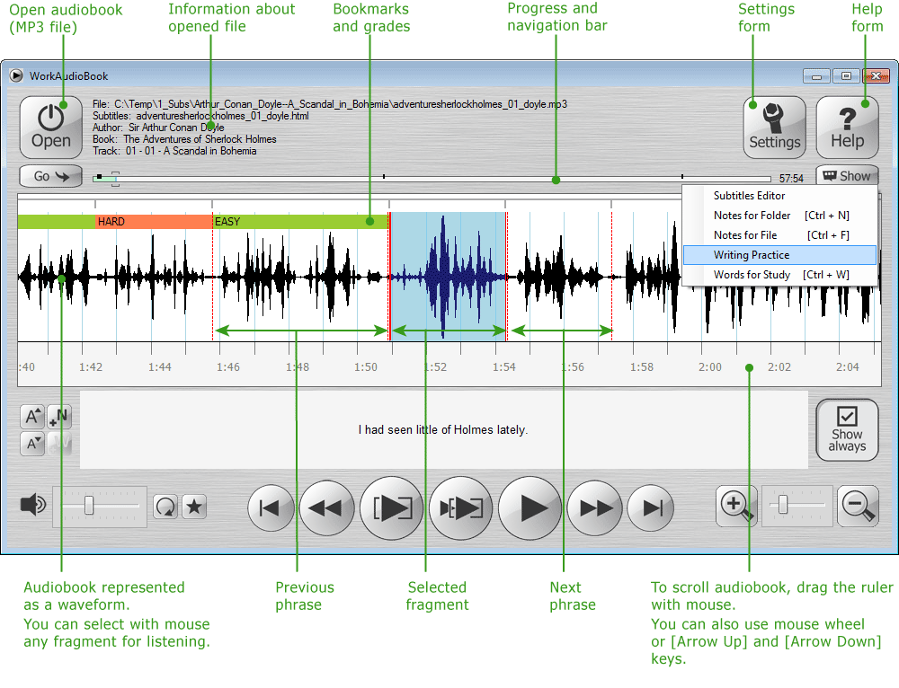
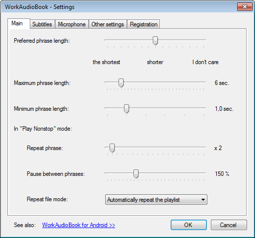

[003b1 WorkAudioBook_milemoa](003b1%20WorkAudioBook_milemoa.md)
# How I started learning English as a language 

 For me, English was one of the test subjects.  In my college hood, I  still didn't like English and it was only needed for TOEIC score.  A year before graduation, I started an AFKN program. The program trained students to listen and dictate after watching US news. The video script was only 3-5min but we had to repeat the same sentence over and over for an hour. It sounds easy and boring but I started enjoying the class. And after 6months, I started understanding what NBC news anchors saying. Once I could focus on "sound" rather than "Word", I started imitating how anchors pronounce and intonations. It was my starting point when I took English as a real language. There was no shortcut to learning a new language. You have to keep repeating it. 
 
# Why do I recommend Work Audio Book? 
The lesson that I got from the AFKN program,was that repeating - listening and speaking was the key. Thus I searched for MP3 player program helping to practice by repeating multiple fragments. And WorkAudioBook has all features that I wanted. 

**Features 
1. Automatic phrase selection 
2. Convenient repeat repetition 
3. Pause between Phrase 

3rd feature is the most important for me. Since I need to speak what I heard, I need to pause its play and make an output. It is a bit different than shadowing. I can only say what I truly understood. I use WorkAudioBook during driving thus I do not need to control the app at all. 

# How to use Work Audio Book? 
* Support systems : **Windows, Android 
* Download : Free for 10min/day in Windows, Android(not sure aobut limitation since I purchased long time aga )
[http://www.workaudiobook.com/](./img/http://www.workaudiobook.com/)
[https://play.google.com/store/apps/details?id=com.povalyaev.WorkAudioBook](./img/https://play.google.com/store/)

It is an application interface and very straightforward. 

Images Source:http://www.workaudiobook.com/workaudiobook/how-to-use(windows).aspx

In the setting, you can split the file into short phrases. And select how long to pause between phrases. 
It has lots of buttons but it is easy and simple to use. 

# Summary 

 I recommend using it without a script first. When new(unknown) vocabulary is heard,  I can simply guess its meaning or search for similar sounds in google that will correct if misspelled. 

This is not shadowing that sometimes deceives me that I speak correctly. It is simply listening and repeating like children do thus I cannot speak any expression that I did not clearly understand. 

Hope it works for many people using English at work and school as an immigrant like me! 
