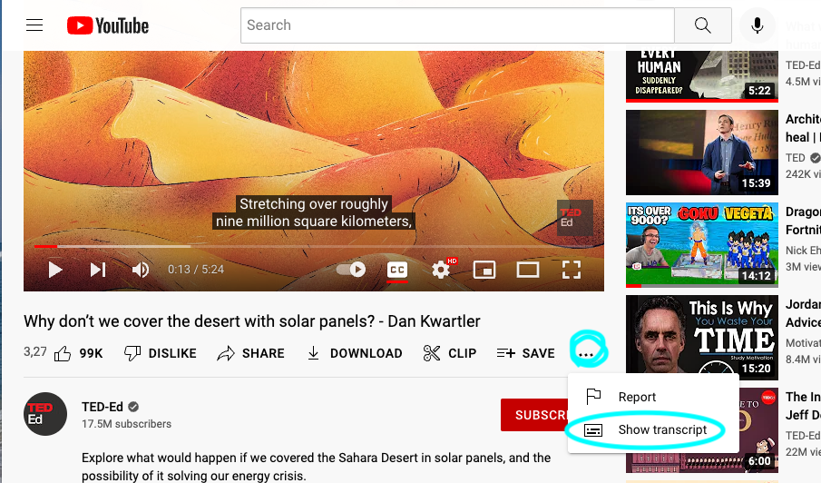
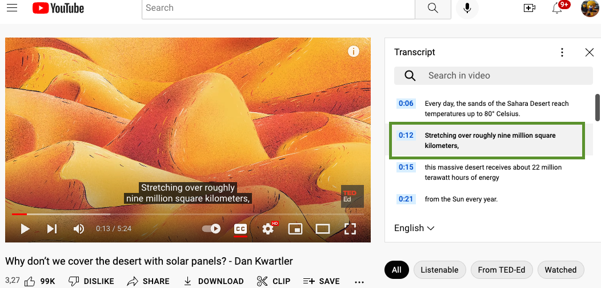
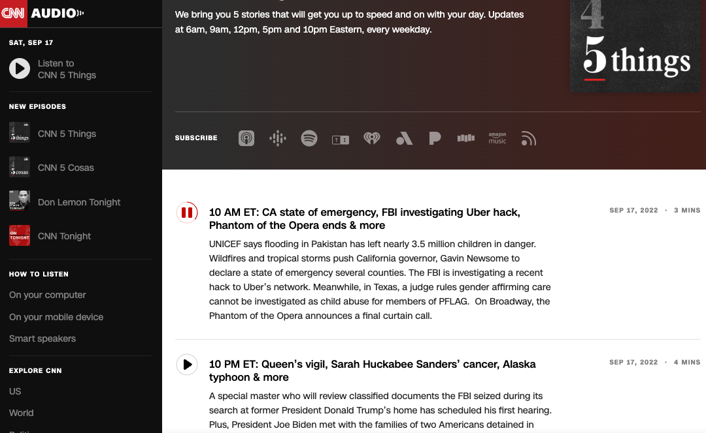
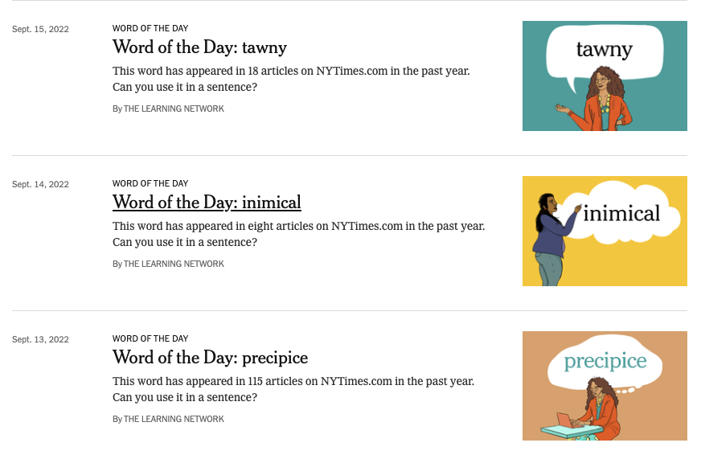

서른 되기 직전 미국에 와서 직장 다니며 매일 영어를 쓰고 살지만 그래도 아직까진 부족한 부분이 많아서 늘 영어를 자주 읽고쓰고 말하려고 합니다. 일하다 보면 입다물고 컴퓨터만 할 때도 많거든요. 

제가 소개해 드리고 싶은  영어 자료 들입니다. 
먼저 요약 부터 하면, 

TedEd :  정말 유익한 컨텐츠, 유투브로 재미있게 
CNN5things : 영어와 시사 뉴스를 같이 하루 3,4분 podcast 로 
NYtimes : 단어 에세이를 미국 고등학생 수준의 - 고급어휘들을 NYT기사와 함께  

그 외 Dave Ramsey  podcast (영어와 함께 경제 관념도 기르는 심심풀이로도 좋은)  NPR podcast ( 라디오 뉴스같은 곳) 도 괜찮습니다. 오늘은 저 세 자료만 먼저 말씀드릴게요. 

# Ted Ed , Youtube transcript 활용하기
Official : https://ed.ted.com/l
Youtube: https://www.youtube.com/channel/UCsooa4yRKGN_zEE8iknghZA 

정말 좋은 자료 많은 곳입니다. 어린 아이들과 같이 볼만한 자료도 많구요.  Transcript 기능은 숨겨져 있어서 모르시는 분들도 계실 거예요. 
Youtube 화면 아래  메뉴에 보시면  점 세개  ''' 누르시면  show transcript 를 클릭하세요 

그러면 Transcript 창이 오른쪽에 보입니다. 여기서 원하는 구간을 계속 클릭하시면 구간 반복? 처럼 들을 수 있어요. 듣기가 약하신 분들은 가능한  자막을 안보시고 반복해서 들으세요. 

# CNN5things 
https://www.cnn.com/audio/podcasts/5-things

NYTime 입니다. 
여기는 중고생들을 위한 사이트 라고 보시면 되는데 수준있는 단어와 그 단어가 사용된 기사도 같이 볼 수 있어요. 
# NewYork times - The Learning Network 
* https://www.nytimes.com/section/learning
* Word of the day 
https://www.nytimes.com/column/learning-word-of-the-day
 

 

