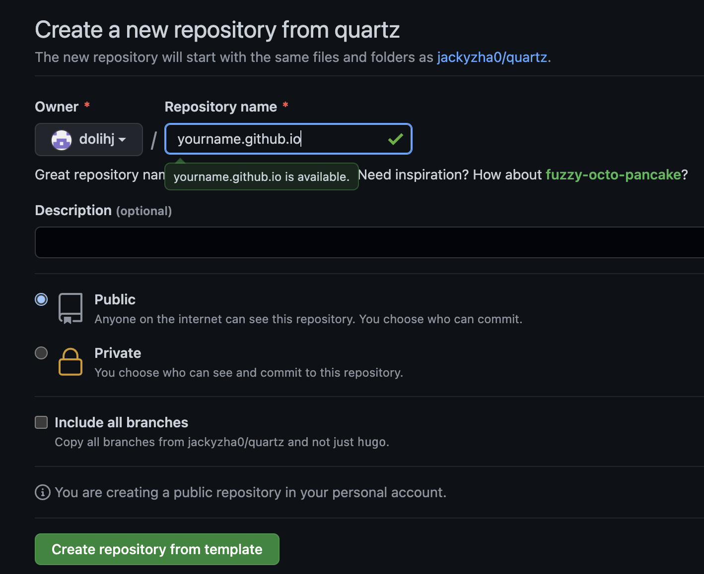

Obsidian? Zettel? [[503_How to Use ZettelKasten]] [[503a_how_to_use_obsidian_link]]

This is a my experience to publish my obsidian notes in this digital garden by using [Quartz](https://github.com/jackyzha0/quartz)  and  [GitHub Page ](https://pages.github.com/) in mid Feb. 2023 

FYI, I've tried jekyll, Gatsby, obsidian-digital-garden, hugo-obsidian templates and [vercel](https://vercel.com), [netlify](https://netlify.com) in one day. 

After struggle with ton of setup guides ( some of them outdated ), I've settle down with [Quartz](https://github.com/jackyzha0/quartz)  and  [GitHub Page ](https://pages.github.com/) 

It is so far the simplest for me - as an existing github user. 
Here is the detail(?) how to  [Deploying Quartz to the Webs](https://quartz.jzhao.xyz/notes/hosting/)


# Create repo with quartz template

1. https://github.com/jackyzha0/quartz
2. create a new repository : Use this template > Create a new repository  ![[005a_quartz.png]]
3. Set your repository name - \<Your-Github-User-Name/>.github.io 
[[005b_repoi.png]] 


4. Go to Action and make workflow enable ( mine is already enabled so I borrow quartz site setup ) 
5. important : Somehow this is not explained ( or at least I cannot find ) but you need to change the permission in Settings >Actions page : ![[005d_i.png]]
6. Change its **check**  :  Read repository contents and packages permissions  ![[005c_workflow_permission.png]]
7. Enable  Github Pages 
8. 


### # Setting up the Site


Now let’s get this site up and running. Never hosted a site before? No problem. Have a fancy custom domain you already own or want to subdomain your Quartz? That’s easy too.

Here, we take advantage of GitHub’s free page hosting to deploy our site. Change `baseURL` in `/config.toml`.

Make sure that your `baseURL` has a trailing `/`!

[Reference `config.toml` here](https://github.com/jackyzha0/quartz/blob/hugo/config.toml)

```
1
```

```toml
baseURL = "https://<YOUR-DOMAIN>/"
```

If you are using this under a subdomain (e.g. `<YOUR-GITHUB-USERNAME>.github.io/quartz`), include the trailing `/`. **You need to do this especially if you are using GitHub!**

```
1
```

```toml
baseURL = "https://<YOUR-GITHUB-USERNAME>.github.io/quartz/"
```

Change `cname` in `/.github/workflows/deploy.yaml`. Again, if you don’t have a custom domain to use, you can use `<YOUR-USERNAME>.github.io`.

Please note that the `cname` field should _not_ have any path `e.g. end with /quartz` or have a trailing `/`.

11. Once deployment is successful, you can see this page. 


