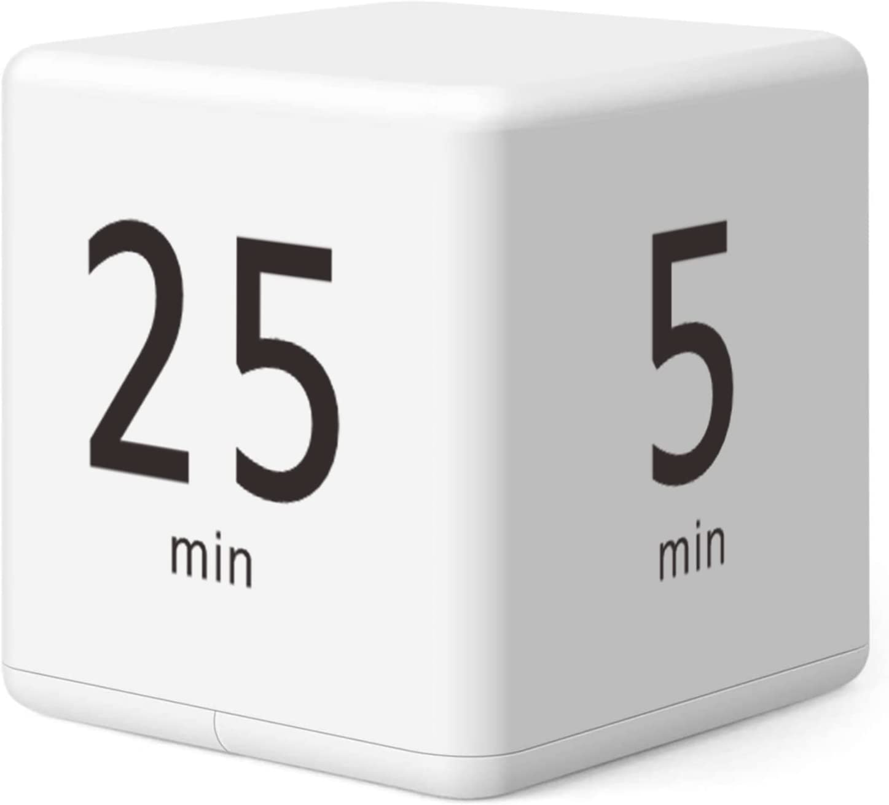

뽀모도로 타이머를 씁니다. 

# What  :  뽀모도로 타이머가 뭐냐구요? 
뽀모도로는 25분 집중해서 일하고 5분 쉬는 방식입니다.  

제가 산 이 큐브형 타이머는 5분/25분/15분/45분 타이머가 미리 설정되어 있어서 뒤집기만 하면 자동으로 타이머가 시작합니다. 원리는 간단하죠? 
그럼 뽀모도로는 왜 할까요? 

# Why : 뽀모도로 타이머를 구입한 이유 

다들 업무 내용이 다르시겠지만, 제 경우 미팅을 제외하고는 시간을 제대로 활용해 보려고 구입했어요.
일하다 보면 시간 가는 줄 모를 때도 있잖아요. 제 경우는 그게 좀 심해서 퇴근할 때 점심 먹는 것도 깜빡한 적이 몇 번 있을 정도 였어요.  집중해서 일하는 것도 좋지만, 너무 심하게 빠져서 일하거나 하면 일 마치고 녹초가 되어서 집에  오면 그것도 좋진 않더라구요. 
그런데 Hyperfocus라는 책을 읽다가 뽀모도로 타이머를 사용해 보기로 했습니다. 

#  Hyperfocus and  ScatterFocus

[[402d_ChrisBailey_Hyperfocus#Ch6. ScatterFocus| Hyperfocus ]] 책을 읽으면서 Scatterfocus 에 대해 새롭게 알게 되었는데요. 단편적으로 멍때리면 뇌에 좋다. 명상이 뇌에 좋다 등의 식으로 알고 있던 막연함을 ScatterFocus chapter를 읽으면서 어떻게 활용할지 고민하기 시작했어요. 
Hyperfocus 는 짐작하시다시피 제대로 집중해서 Productivity를 올리는 행위이고, ScatterFocus는 명상/운동/요가 처럼 뇌를 자유롭게 풀어두고 Creativity를 키우기위한 행위라고 보시면 되요. Distraction과는 다릅니다. 오히려 샤워를 하거나,  잠들기 전이라던가, 산책을 하며 의식적으로 (Intentionally) 떠오르는 생각들을 자유롭게 내버려 두는 시간이라고 보시는 게 더 정확합니다.  단순히 쉬는 시간, TV보며 쉬는 여가 시간과 구분이 되시나요? 
Hyperfocus와 ScatterFocus는 서로 대비되는 개념이라기 보다, 상호 보완적이라고 생각하는데요. Productivity를 위해 집중해서 일하다가 막힐 때, ScatterFocus 시간에 꽤 신박한 개념이 갑자기 떠오르는 사례가 자주 있지요. Archimedes가 Eureka를 외쳤던 곳이 왜 하필 목욕탕이었을까요? 욕조에 물을 담그는 행위에서 힌트를 얻긴했지만, Scatterfocus하기 좋은 시간이 샤워나 목욕할 때 이기도 하거든요. 실제로 샤워하다가 괜찮은 아이디어가 떠오른 적 있지 않으신가요? 
 Scatterfocus는 이 정도로만 하고, 뽀모도로와 어떻게 연관 되는지 알아볼게요. 

# Over-stimulated Brain and Pomodor Timer 
Cal Newport 교수의 책 Digital minimalism과 DeepWork을 봐도 비슷한 내용이 나오는데, 요즘 'Digital Distraction'을 많이들 고민하잖아요? Hyperfocus의 저자 Chris Bailey는 우리의 뇌가 Distracted 된다기 보다는 Over-stimulated 과도하게 지속적으로 자극을 받는 게  맞다고 설명합니다. 실제로 SNS나 유툽, 블로그나 카톡, 이메일을 지속적으로 확인하는 것도 도파민 분비에 뇌가 자극을 과도하게 받기 때문에 정말 집중해야할 때 제대로 집중하지 못하게 된다고 합니다. 
그렇다고 폰을 없애버릴 수는 노릇이죠. 그래서 저는 집중해서 일해야 한다면 가능한 폰을 잘 안보이는 곳( 가방이나 모니터뒤)에 두고 뽀모도로 타이머를 시작합니다. 25분입니다. 

# HOW : 뽀모도로 타이머 활용법 

집중하는 시간이 너무 짧은 거 아니냐구요? 25분은 짧게 느껴지기도 하지만, 의외로 많은 일을 해치울 수 있는 시간이기도 합니다. 
어쩐지 하기 싫어 미루던 일을 25분간 해볼까 하고 타이머를 키고 시작해 보면 시간 안에 다 해치우기도 하고, 끝내지못했는데 타이머가 울릴 때도 있습니다. 끝내면 성취감에 기분이 좋고 못 끝내면 5분 쉬었다 다시 해야겠다고 마음을 먹습니다. 

제게는 이 5분이 앞의 25분 보다 더 중요한 시간인데요. 
집중해서 일하는 시간은 에너지를 쏟은 시간이고, 이제 충전을 해야 하거든요. 충전은 길진 않지만 꼭 필요합니다, 그리고 배터리가 방전 되기 전에 충전하는 게 효율이 더 좋아요. 다이어트 할 때도 배가 너무 고프기전에 건강한 메뉴를 적당한 양을 먹으라고 합니다. (너무 배고프면 건강한 메뉴보다 열량높고 자극적인 음식을 찾게 되더라구요) 이 처럼,  Next Hyperfocus 시간을 위해서라도 5분간 모니터에서 눈을 떼고 조금 걷거나, 스트레칭을 하거나, 노트에 뭔가를 끄적거리다 보면 지치지 않고 다시 집중해서 일할 수 있어서 좋았습니다. 
다시 25분이니까 별 고민안하고 바로 집중할 수 있게 되어서 일 하기 전에 밍기적 거리는 시간이 줄었습니다

# Thumbs up! Cube timer 

이 큐브 타이머를 구매하기 전에  폰에서 pomodor 앱을 깔아서 쓰기도 했는데요.  일단 전화기를 손에 쥐게 되면 문자나 이메일 등을 확인할 위험이 있고 앱 access가 번거로웠습니다.  그리고 focus타임,  break time 시작을 꼭 해야해서 은근 불편하더라구요. Cube는 그냥 뒤집으로 바로 25분, 5분 왔다갔다 번갈아 할 수 있고, 잠시 Pause 하거나, 미팅 시간에는  위로 뒤집으면 바로 stop 되기 때문에 아주 편합니다. 
저는 5분 25분이 아주 잘 맞지만, 사람마다 다른 시간 설정이 필요할 수 도 있죠.  그래서 15/20/30/60 이나 다른 시간이 설정된 타이머도 있더라구요.  저는 써보니 시간 활용도 더 잘 하게 되서 꽤 괜찮은 투자라고 생각합니다. 이 글 보시는 분도 한번 고려해 보세요. 

