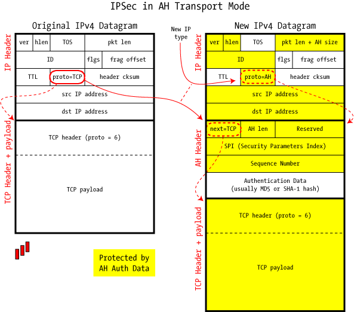
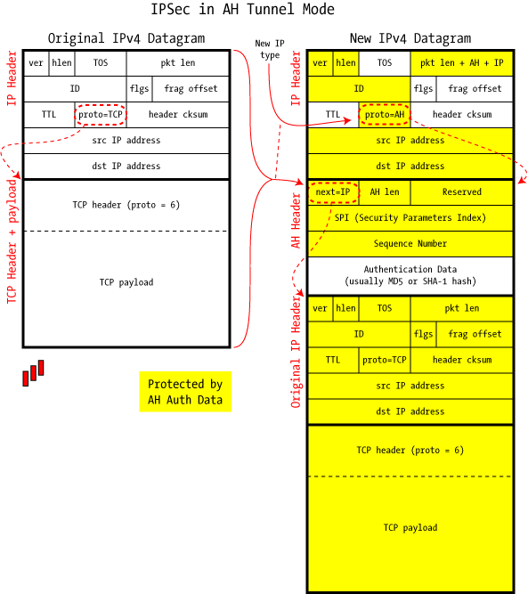

2022-05-24

# IP Sec

````yml
IP Sec
    Service:    
    Protocol:
    - AH
    - ESP

Mode:
  - Transport
    why: Protect communication between End Users
  - Tunnel
    why: Protect communication between VPN Gateway

VPN Access:
  - IPSec VPN # STS
  - SSL VPN

````

^a80e6f

## ref
* What/ Why / How
http://itnovice1.blogspot.com/2019/09/ipsec.html
* What is? 
https://aws-hyoh.tistory.com/162

* GNS3Vault Lab
https://gns3vault.com/tunneling/site-to-site-ipsec-vpn

[[101a_STS_VPN_gns3]]

# Frame

 
ref source : http://www.unixwiz.net/techtips/iguide-ipsec.html



