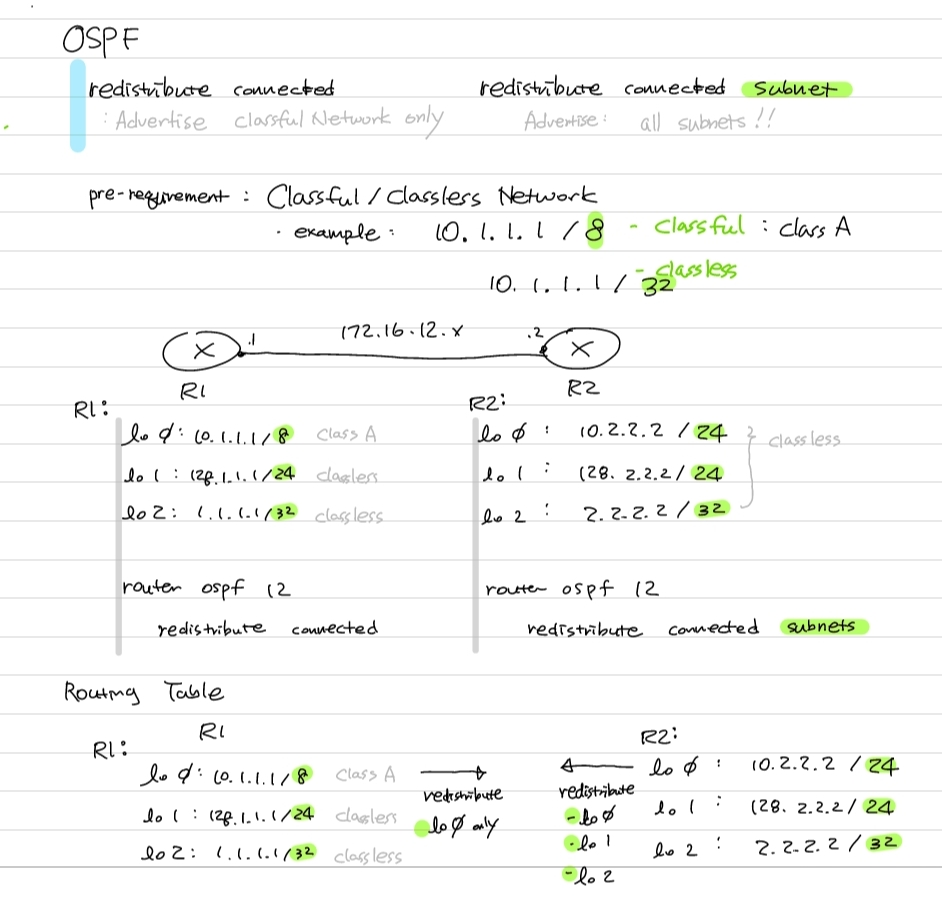

#ospf

Question : In OSPF redistribute statement - what is the difference between 
"redistribute connected " and "redistribute connected subnet"

without subnet options, it redistribute the classful network only ( without subnet mask )

