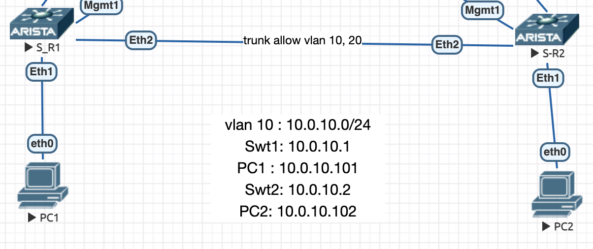
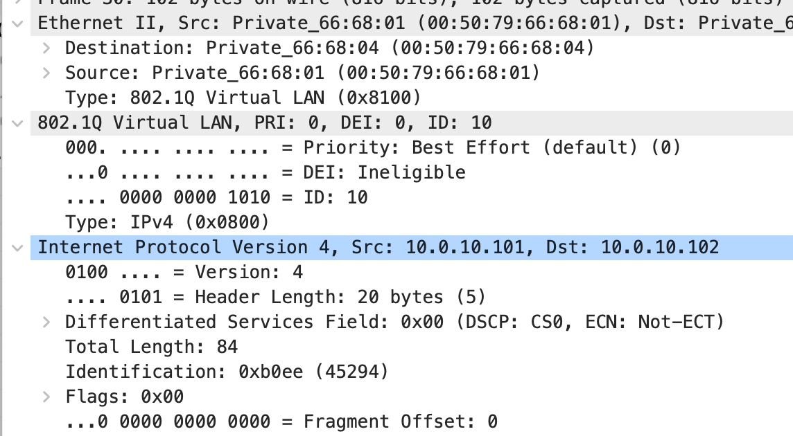
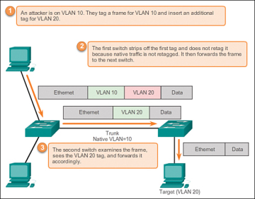

tags: #vlan
# Access port - Untagged 


Native Vlan: 1 beween S-R1 and S-R2 
802.1q tag is shown in S-R2 eth2. 


Native vlan config - No 802.1Q tag is shown 
```
S-R2(config-if-Et2)#switchport trunk native vlan 10
S-R2(config-if-Et2)#
```


# vlan dot1q tag native 

it prevent the double-encapsulation attacks - all switch trunk. the native vlan is always tagged on every trunk on the switch 

# Double encapsulated attack / Double-tagging attack / Vlan hopping attack
ref : https://www.ciscopress.com/articles/article.asp?p=2181837&seqNum=10



## mitigation 1

int ETH_ATTACKER_PORT
switchport mode access 
switchport access vlan USER_VLAN_ID
! Do not turn into Trunk mode by DTP protocol thus an attacker cannot manupulate the port as trunk 
_switchport nonegotiate_
! Device will not engage in negotiated protocol 

## mitigation 2
int ETH_INTERSWITCH
switchport turnk native vlan UNUSED_VLAN 
switchpor trunk allowed vlan ONLY_ALLOWED_VLAN 


