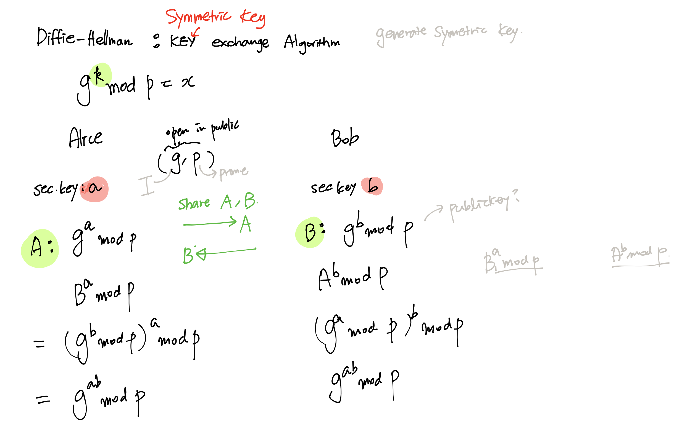
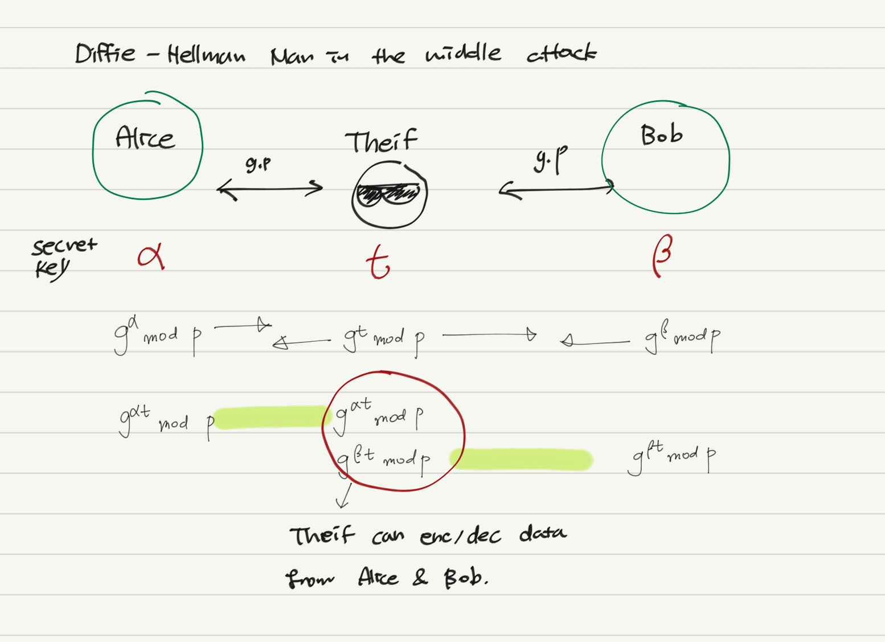

[[101_What_is_IPSec]] Wanted to know detail about Diffie-Hellman while reading

Reference:  
[# 기초 암호학(3) - 공개키 암호 (RSA, Diffie-Helmman)](https://developer-mac.tistory.com/76#:~:text=Diffie%2DHellman%EC%9D%80%20RSA%EC%B2%98%EB%9F%BC,DH%20%ED%94%84%EB%A1%9C%ED%86%A0%EC%BD%9C%EC%9D%B4%EB%9D%BC%EA%B3%A0%20%EB%B6%80%EB%A5%B8%EB%8B%A4)

# Diffie-Hellman Key Exchange Algorithm

Diffie-Hellman is used for Key exchange not for encryption 

# Diffie-Hellman Vulnerability 
Man in the middle attack 

# Why use RSA and Diffie-Hellman together?

RSA( public key) is good for **security**  but **complicated computation** takes device resources. 
Diffie-Hellman is good for symmetric key exchange but it is vulerable to **man-in-the middle attack**

Thus sharing key encrypted with public key + digital cert would be a solution 
