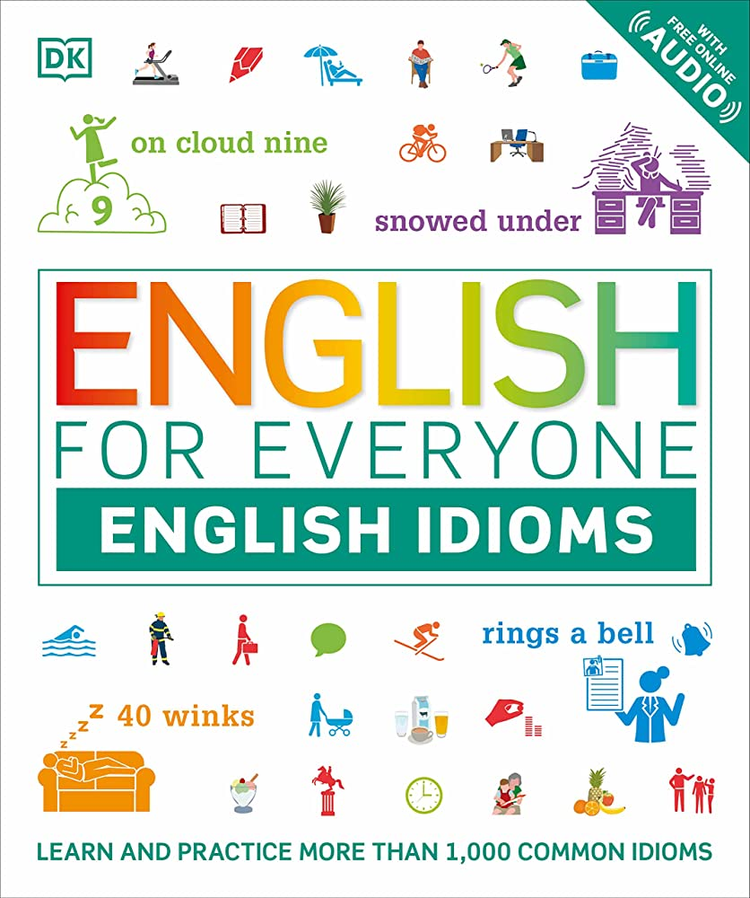

Try to Practice my 2nd language 
And I will try 3rd one in 2023

# My Practice 

[[301 Ted Ed English Practice |Weekly TedEd and English Idiom]]

# Tools that I use

## English Idiom Book 

## WorkAudioBook (free ver. 10min/day)

[[302 Tool I've used for practicing English as a non-native speaker - WorkAudioBook]]

## Youtube, New York Times

[[302c  ESL Resource들, 유투브 활용법]]

