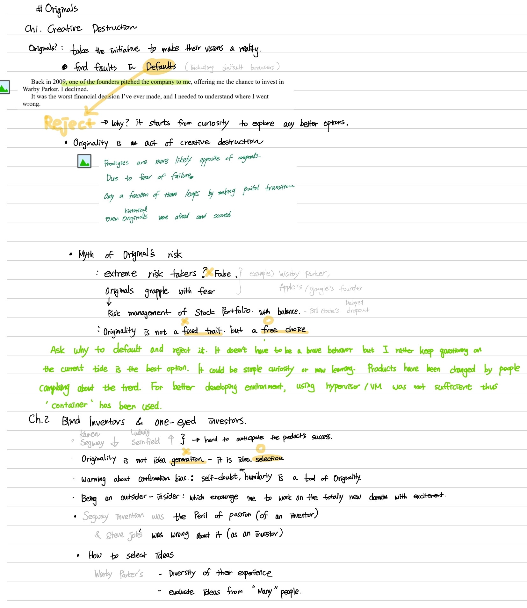
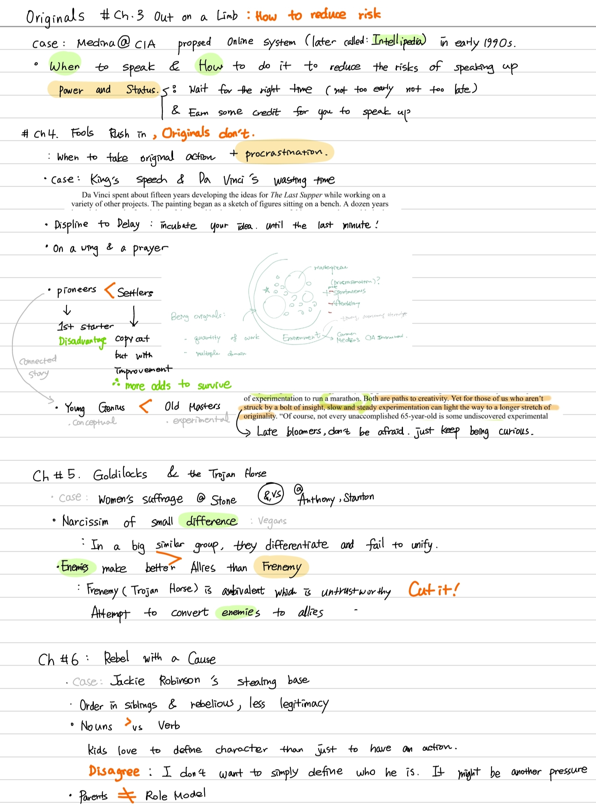
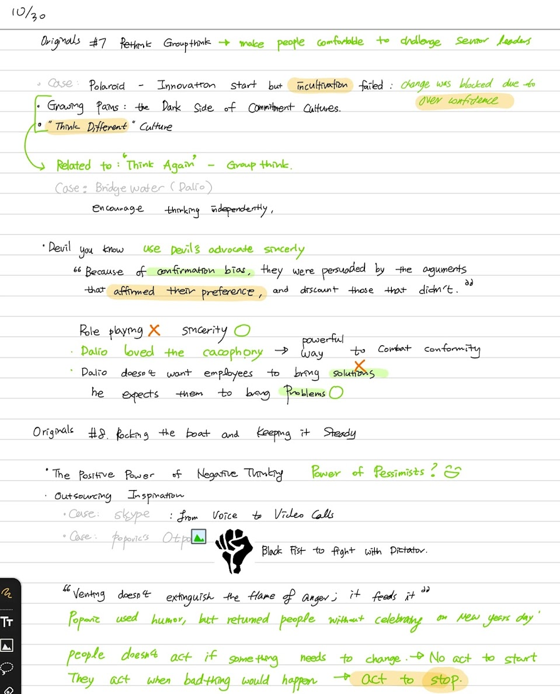

# Author's Ted
<iframe width="560" height="315" src="https://www.youtube.com/embed/fxbCHn6gE3U" title="YouTube video player" frameborder="0" allow="accelerometer; autoplay; clipboard-write; encrypted-media; gyroscope; picture-in-picture; web-share" allowfullscreen></iframe>

What is Originality : By not having conformity originality championing! a set of novel idea which will refuse to take the default as the only option. 
How to start originality : Question to defaults. Do not take the default granted and believe you have freedom to be flexible 
How to be a safe originals ? release the pressure to achieve  thus you can take some risk like stock portfolios instead of extreme risks. 

Originality starts from questioning the defaults. They refuse to take the defaults granted and make their visions a reality. 

Story examples are introduced, Warby Parker - internet eyewear company and non-default browser users. . How they approach to the existing products were different than others.  It starts with curiosity 

## Kissing frogs 
Do a huge volume of work 
When it comes to idea generation, quantity is the most predictable path to quality 

* Expressions 
he **churn out** the works. 
the most **eminent** creators produce a large quantity of work 
The number of truly superlative achievements can be count on the fingers of one hand
A different headline led to 59times more views, enticing nearly half a million people to watch the video.

## Originals risk is like stock portfolio 
Myth : The originality requires extreme risk taking 
In stock market, when we embrace danger in one domain, we offset our overall level of risk by exercising cushion in another domain.
It is beneficial of balanced risk portfolio: Having a sense of security in one realm gives us the freedom to be original in another. 
Thus successful originals take extreme risks in one arena and offset them with extreme caution in another 
