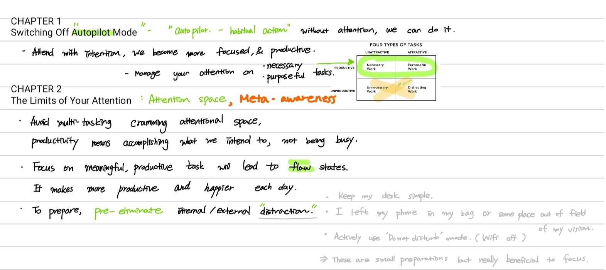

# Ch.1 

Related books : 
- Deep Work by Cal Newport 
- How will you measure your life by Clayton Christensen 

# ScatterFocus 

Well,To be a good lumber jack, we cannot just chop down a tree for hours without resting. It might be a better strategy by taking 10min break to sharpen our axes in every hour. 
This 5-10min scatterfocus time will sharpen yourself and help you focus easier. 

# Author's Tedtalk - for youtube lovers 

<iframe width="560" height="315" src="https://www.youtube.com/embed/REFh5TMOoS0" title="YouTube video player" frameborder="0" allow="accelerometer; autoplay; clipboard-write; encrypted-media; gyroscope; picture-in-picture; web-share" allowfullscreen></iframe>

<iframe width="560" height="315" src="https://www.youtube.com/embed/Hu4Yvq-g7_Y" title="YouTube video player" frameborder="0" allow="accelerometer; autoplay; clipboard-write; encrypted-media; gyroscope; picture-in-picture; web-share" allowfullscreen></iframe>

