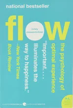

 > p.30 : How many people do you know who enjoy what they are doing, who are reasonably satisfied with their lot, who do not regret the past and look to the future with genuine confidence? 
 
 similar concept: control of consciousness is similar to "aware intentionally" in [[402d_ChrisBailey_Hyperfocus|hyperfocus]]. I believe the control - over time or myself will be the key element to answer to this question
