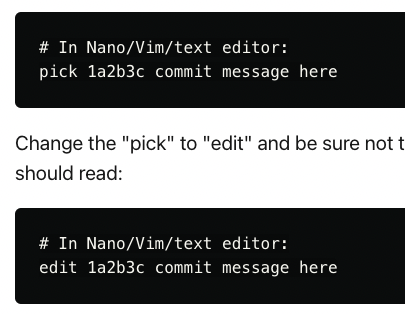

---
tags:
 - git
 - git_reset
---
[[git]]

# cancel revert commit 
git rebase -i _REMOVE_REVERT_COMMIT_
git reset _COMMIT_ID_ 
 - git reset --hard _COMMIT_ID
 - git reset --soft _COMMIT_ID
: cancel this commit 

git merge Robyn's link : looks like you need to [bring the branch up-to-date with the main branch](https://gist.github.com/santisbon/a1a60db1fb8eecd1beeacd986ae5d3ca "https://gist.github.com/santisbon/a1a60db1fb8eecd1beeacd986ae5d3ca") before it 

# Git: your email is not a member of team!

Ref : https://dev.to/copypastepray/git-your-email-is-not-a-member-of-team-5cpa 

git rebase -i _COMMIT_ID_

git commit --amend --author="HJ Park <hyun.park@jhuapl.edu>"

# undo git add 
git reset _file.  or git reset __ 

# Unstage from working directory
git restore 

