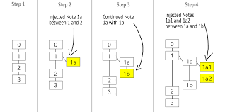
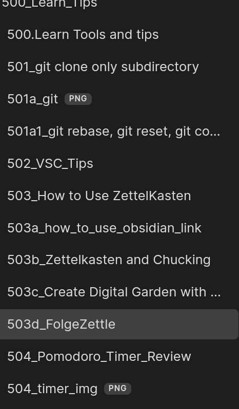

# What is FolgeZettel? 

Adding index number  in the note. 
It decides note's location in the box - Analog or folder - Digital.

# Why ? 

Whether it is analog or digital, you can imagine only one folder directory. with Folge numbering, the note finds its location pretty easily 

This is example of my 500 box - adding some tool tips or how to notes. 

## So... benefit from Folge? 
The real benefit that I can get from folge is "you need to scan the previous notes to place a new note."  - This is not my idea. I learned it from a community member who uses analog zettel. In analog, you must index the note and place it where it belongs. There is no "Search", "Tag", "Graphview" thus deciding note location is critical and mandatory.  

Then next question will be , why do you use folge in digital tool? 
The real benefit is not "file location" but scanning previous tree. To place or deciding index number, you need to skim thru the existing notes. While doing that, I confirmed what I've thought before and my think-flow. If I need to search my notes, I rather to scan my notes than typing in the search box.  I might forget the detail content of the note but I can solidify my concepts of the note.  

