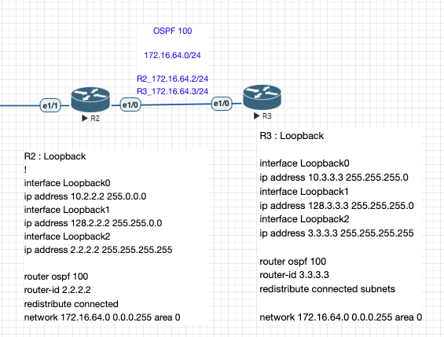
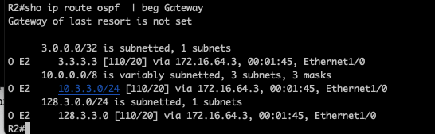
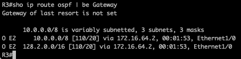

#routing #redistribute_connected_subnets #eve-ng

ref : [cisco # Redistribute Connected Networks into OSPF with Subnet Keyword](https://www.cisco.com/c/en/us/support/docs/ip/open-shortest-path-first-ospf/113339-ospf-connected-net.html)

-----
## Device Config 
R2 : Loopback 
! 
interface Loopback0
 ip address 10.2.2.2 <mark class="hltr-orange">255.0.0.0</mark>
interface Loopback1
 ip address 128.2.2.2 <mark class="hltr-orange">255.255.0.0</mark>
interface Loopback2
 ip address 2.2.2.2 <mark class="hltr-orange">255.255.255.255</mark>
interface Ethernet1/0
 ip address 172.16.64.2 255.255.255.0
 
router ospf 100
 router-id 2.2.2.2
 <mark class="hltr-orange">redistribute connected</mark>
 network 172.16.64.0 0.0.0.255 area 0

R3 : Loopback 

interface Loopback0
 ip address 10.3.3.3 <mark class="hltr-orange">255.255.255.0</mark>
interface Loopback1
 ip address 128.3.3.3 <mark class="hltr-orange">255.255.255.0</mark>
interface Loopback2
 ip address 3.3.3.3 <mark class="hltr-orange">255.255.255.255</mark>
interface Ethernet1/0
 ip address 172.16.64.3 255.255.255.0
 
router ospf 100
 router-id 3.3.3.3
 redistribute connected <mark class="hltr-orange">subnets</mark>
 network 172.16.64.0 0.0.0.255 area 0

## OSPF Result

 
 

## redistribute connected _subnets_
R2 - redistribute connected : 
 only redistribute classful network - Loopback0 (10.x.x.x/8 class A) and Loopback1(128.0.0.0/16 class B) but loopback2 (2.2.2.2/32) is not redistributed. 

R3's redistribute connected <mark class="hltr-orange">subnets</mark> 
 R3 redistributes all loopbacks ( classless network ) as verified in R2 routing table. 

Note : Network statements is LSA type3 network 
network 172.16.64.0 255.255.255.0 

## OSPF 

network:  metric [110/65] 
redistribute : metric [110/20]
 - ASBR router 
